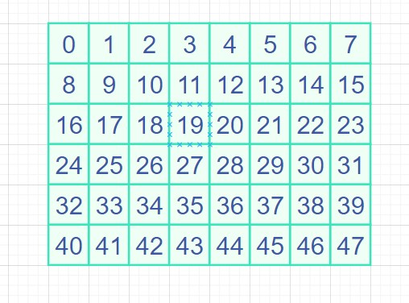
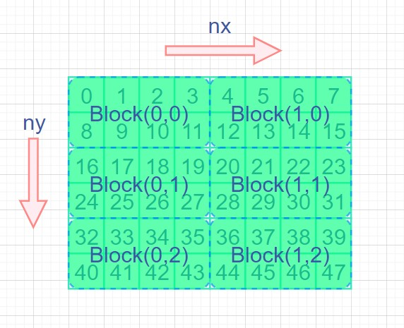
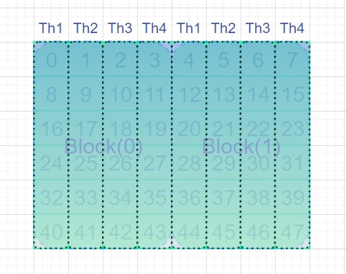

## 2.1 CUDA编程模型概述

### 2.1.1 CUDA编程结构
在一个异构环境中包含多个CPU和GPU，每个GPU和CPU的内存都由一条PCI-E总线隔开

CUDA内核一旦被启动，管理权立刻返回给主机，释放CPU来执行由设备上运行的并行代码实现的额外的任务

CUDA编程是异步的，**因此GPU运算可以和CPU的设备通信重叠**

### 2.1.2 内存管理
CUDA内存管理自带的函数与C语言的函数是一一对应的关系

- malloc ----- cudaMalloc
- memcpy ----- cudaMemcpy
- memset ----- cudaMemset
- free ----- cudaFree

cudaMemcpy原型为
```cpp
cudaError_t cudaMemcpy(void* dst, const void* src, size_t count, cudaMemcpyKind kind)
```
此函数从src复制一定数量字节到dst

**而kind指定的是复制方向**，包括以下几种
- cudaMemcpyHostToHost 
- cudaMemcpyHostToDevice 
- cudaMemcpyDeviceToHost 
- cudaMemcpyDeviceToDevice

为了保证数据传输完全，这个函数是**同步的**（在cudaMemcpy函数返回以及传输完成前，主机应用程序是**阻塞的**）

而返回类型 `cudaError_t` 是一个错误的枚举类型
分配成功返回 `cudaSuccess` 否则返回 `cudaErrorMemoryAllocation`

我们可以使用 `char* cudaGetErrorString(cudaError_t error)` 将错误代码转化为可读的错误信息

GPU内存结构包含 **全局内存（类似于CPU的系统内存）** 和 **共享内存（类似于CPU的缓存）**

下面实现一个两个向量进行elementwise_add的C程序，具体可参考 `sumArraysOnHost.c`

你可以使用gcc编译，也可以用nvcc编译，nvcc封装了几种编译工具，可以在命令行选项在不同阶段启动不同工具
```shell 
nvcc -Xcompiler -std=c99 sumArraysOnHost.c -o sum
```

我们可以基于前面的知识来改造成GPU函数，具体可参考 `sumArraysOnDevice.cu` 文件

### 2.1.3 线程管理
CUDA将线程层次结构抽象成 `线程块网格Grid` 和 `线程块Block` 这两层。

**一个内核启动所产生的所有线程统称为一个网格Grid**，同一网格中的所有线程共享相同的全局内存空间

一个线程网格grid由多个block组成

一个线程块block由多个thread线程组成

同一线程块内的线程协作通过 `同步` 和 `共享内存` 来实现的。

线程由两个坐标变量 `blockIdx(block在grid里的索引)` 和 `threadIdx(thread在block里的索引)`

这两个坐标变量都是一个uint3类型定义的三维向量
`blockIdx.x`, `blockIdx.y`, `blockIdx.z`同理有 `threadIdx.x`, `threadIdx.y`, `threadIdx.z`

block和grid的维度由 `blockDim(块的维度)` 和 `gridDim(格的维度)`，他们也有对应的 x,y,z 字段

> 通常一个Grid会被组织为 **Block** 的二维形式，而一个Block会被组织为 **thread** 的三维形式。 但是他们均使用3个dim3字段（x,y,z），没用的初始化为1

相关打印block，grid坐标代码可以参考 `checkDimension.cu`. 

确定网格和块的代码可参考 `defineGridBlock.cu`

### 2.1.4 启动一个CUDA核函数
CUDA内核调用服从如下方式

```cpp
kernel_name <<<grid, block>>>(argument list)
```

第一个值是网格维度，也就是**线程块的个数**

第二个值是线程维度，也就是**每个块的线程数目**

如果需要计算32个元素，我们可以分配8个块，每个块有4个线程，形式如下

```c++
kernel<<<8, 4>>>(...)
```

核函数的调用与主机线程是异步的。即**核函数调用结束后，控制权立刻返回给主机端**
我们调用 `cudaDeviceSynchronize` 来强制主机端程序等待所有的核函数执行结束

还有一些CUDA API在运行时候，是在主机和设备之间**隐式同步**的，比如`cudaMemcpy`

### 2.1.5 编写核函数
我们看下限定符

- `__global__` 在设备端执行，可从主机端调用，必须有一个void返回类型
- `__device__` 在设备端执行，仅能从设备端调用
- `__host__` 在主机端执行，仅能从主机端调用，可以省略

`__device__` 和 `__host__`可以一起使用，即这个函数可以同时在主机和设备端进行编译

还是向量相加的程序，我们在cpu端，写的串行代码就是一个for循环。
而在核函数里，由于是多线程启动的，所以我们完全可以抛弃掉for循环，形如
```cpp
__global__ void sumArraysOnHost(float *A, float *B, float *C, const int N){
    // Do elementwise add
    int idx = threadIdx.x;
    C[idx] = A[idx] + B[idx];
}
```
然后启动对应线程数量（等于操作的元素数量）的核函数即可

### 2.1.6 验证核函数
我们可以编写一个主机函数，以串行的方式去验证我们的正确性，具体可以参考代码的 `checkResult` 方法。

调试技巧： 
1. 可以在核函数用printf
2. 执行参数设置为<<<1, 1>>>，这样就是串行了

### 2.1.7 处理错误
CUDA异步调用难以确定具体运行错误的位置，因此我们可以封装一个CHECK宏，包住CUDA API调用，具体可以参考代码

完整的程序可参考 `sumArraysOnGPU-small-case.cu` 
因为是定义1个块，所以索引可以直接用 `threadIdx.x`， 如果是多个块则数据是错的。

一般情况下，可以基于给定的一维网格和块的信息来得到全局数据的唯一索引，如
```cpp
int i = blockIdx.x*blockDim.x + threadIdx.x
```

## 2.2 给核函数计时
### 2.2.1 用CPU计时器计时
导入 `sys/time.h` 使用 `gettimeofdat` 函数，它会返回自1970年1月1日零点以来到现在的秒数
```cpp
double cpuSecond(){
    struct timeval tp; 
    gettimeofday(&tp, NULL);
    return ((double)tp.tv_sec + (double)tp.tv_usec*1.e-6);
}
```
注意的是CUDA是异步的，所以我们得用 `cudaDeviceSynchornize` 等待所有GPU线程运行结束，再调用。
具体可以参考 `sumArraysOnGPU-timer.cu` 

不同的设备，对网格和块的限制也不一样

### 2.2.2 用nvprof工具
用法 
```shell
nvprof [nvprof_args] <application> [application_args]
```
我们测试上面的程序
```shell
nvprof ./xxx
```
通信比在高性能计算里十分重要
如果计算时间大于数据传输的时间，可以进行压缩，并隐藏与传输数据有关的延迟
反之，则需要尽量减少主机和设备之间的传输

## 2.3 组织并行线程
### 2.3.1 使用块和线程建立索引
这里我们以一个8 x 6的矩阵为例



我们为此分配4x2大小的线程块，每个线程块分配2x3大小的线程

对应到矩阵上就是



以这种形式组织的时候，我们计算坐标的公式如下

```
ix = threadIdx.x + blockIdx.x*blockDim.x
iy = threadIdx.y + blockIdx.y*blockDim.y
```
然后映射到全局索引上
```
idx = iy*nx + ix
```

相关代码可参考 `checkThreadIndex.cu`
在该代码里，我们指定了一个block的大小是(4, 2)，然后根据公式计算所需的grid数目
对于一个矩阵来说，就类似划窗的操作

### 2.3.2 使用二维网格和二维块对矩阵求和

坐标的推算跟上面一致

代码可参考 `sumMatrixOnGPU-2D-grid-2D-block.cu`

### 2.3.3 使用一维网格和一维块对矩阵求和
此时架构变成一维网格和一维线程块


这就意味着每个线程不像之前一样，只需要处理一个元素，此时它还需要处理y方向的元素

还是以8 x 6的矩阵为例子，我们分配2个块，每个块有4个线程



我们确定index，首先确立X方向的

```cpp
ix = threadIdx.x + blockIdx.x*blockDim.x;
```

然后每个线程，需要处理y方向的6个元素，因此我们需要一个for循环去执行

```cpp
ny = 6;
nx = 8
for(int iy=0; iy<ny; iy++){
	int idx = iy*nx + ix; // 得到对应的索引
}
```

代码可参考 `sumMatrixOnGPU-1D-grid-1D-block.cu`
这里只使用了一维网格和一维块，因此我们只会用threadIdx.x

核函数也要进行一个改变，变换成一个以y为变量的循环加

### 2.3.4 使用二维网格和一维块对矩阵求和
代码可参考 `sumMatrixOnGPU-2D-grid-1D-block.cu`

下面是矩阵坐标的推导
```cpp
ix = threadIdx.x(表示第几个线程) + blockIdx.x(在x方向的Block index)*blockDim.x(Block长度)
iy = blockIdx.y(在y方向的Block index)
```

从以上例子可以得出
- 相同网格和块下，不同执行配置，运行效率不同
- 不同网格和块的分配下，运行效率不同
