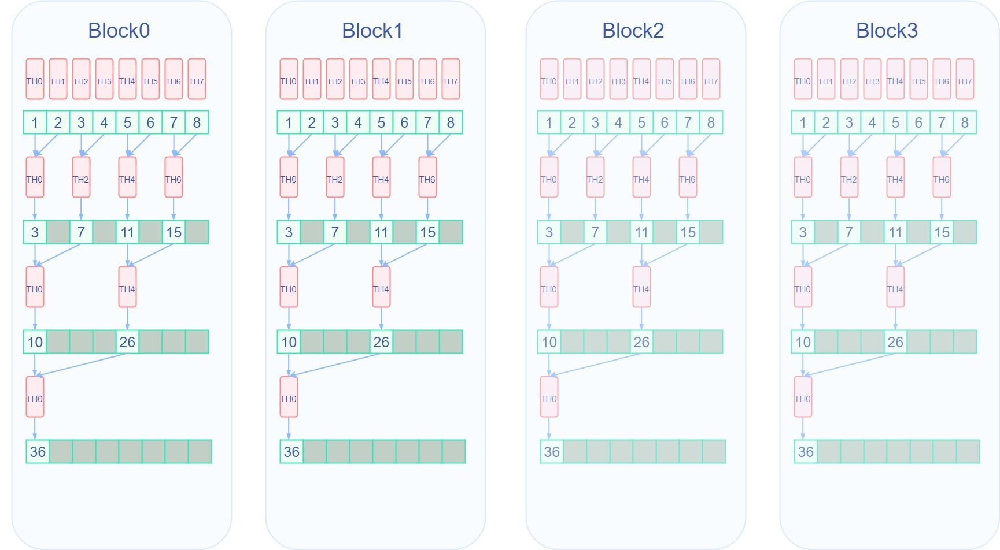
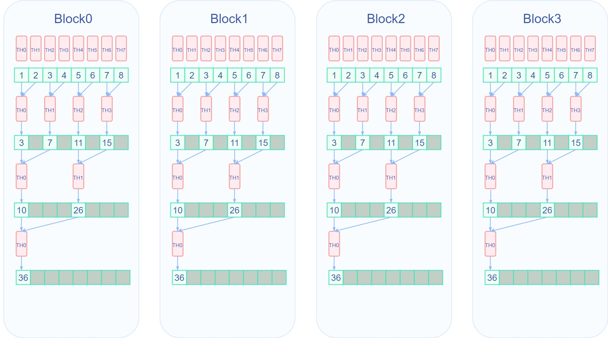
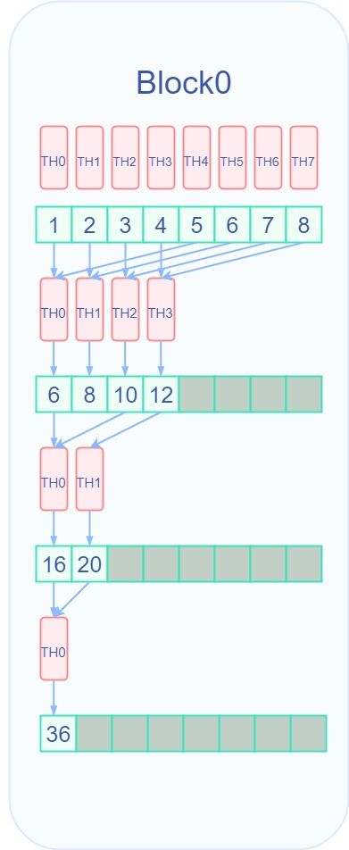
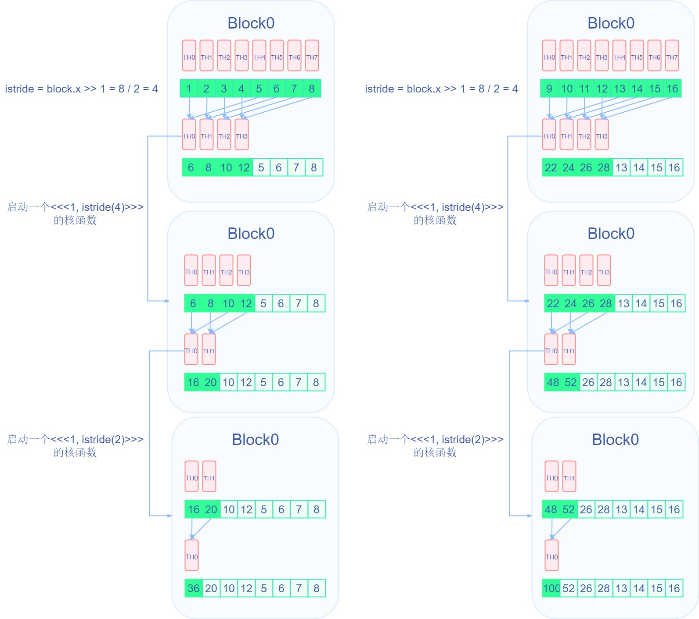
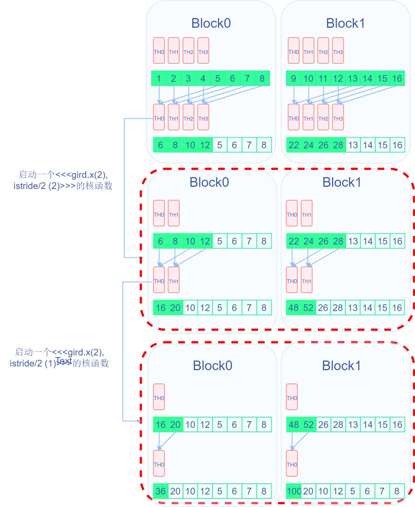

# 3.1 CUDA执行模型概述
## 3.1.1 GPU架构概述
GPU架构主要围绕一个**流式多处理器（SM)**的可扩展阵列搭建的

CUDA采用单指令多线程(SIMT)来管理执行线程，**将32个线程分为一组，称为线程束warp**
线程束的线程有以下特点
- 所有线程同时执行相同的指令
- 每个线程都有自己的指令地址计数器和寄存器状态

每个SM将分配到的线程块，划分到线程束中，再调度执行

#### SIMT和SIMD单指令多数据结构很类似，关键的区别是
- SIMD要求一个向量的所有元素要在一个同步组执行，而SIMT的每个线程都是独立执行的

#### SIMT模型包含3个SIMD不具备的特征: 
- 每个线程有自己的指令地址计数器
- 每个线程都有自己的寄存器状态
- 每个线程可以有一个独立的执行路径

#### 线程块和SM的关系：
- 一个线程块只能在一个SM上被调度，被调度后会保存在该SM上，直到执行完成

线程块的所有线程在逻辑上是并行运行，但实际上，并不是所有线程都可以同时在物理层面执行。线程块里的不同线程可能会以不同的速度前进

并行线程中共享数据可能会导致多个线程在未定义的顺序下访问同一个数据，造成行为不可预测

而CUDA提供了**同步线程块里的线程的方法**，保证所有线程在进一步动作之前都达到执行过程中的一个特定点。

# 3.2 理解线程束执行的本质
## 3.2.1 线程束和线程块
从硬件的角度来看，线程块可以被配置为一，二，三维，**所有的线程都被组织为一维**

我们以x维度作为最内层维度，y维度作为第二个维度，z维度作为最外层维度

**在一个块中**，对于一个二维线程块，则每个线程的index可以用公式
```text
index = threadIdx.y*blockDim.x + threadIdx.x
```
对于一个三维线程块，则公式为
```text
index = threadIdx.z*blockDim.y*blockDim.x + threadIdx.y*blockDim.x + threadIdx.x
```

线程束的数量是 线程数量//线程束大小（即32），向上取整

如果线程数目不是线程束的整数倍，则会有部分线程束不活跃。**即使这些不活跃的线程未被使用，但它们仍然消耗SM的资源。**

## 3.2.2 线程束分化
GPU是相对简单的设备，没有像CPU的复杂分支预测机制。一个线程束中的所有线程在同一周期必须执行相同的指令

**在同一线程束中的线程执行不同的指令，被称为线程束分化**

假设我们有以下代码
```cpp
__global__ void mathKernel1(float *c)
{
    int tid = blockIdx.x * blockDim.x + threadIdx.x;
    float ia, ib;
    ia = ib = 0.0f;
    if (tid % 2 == 0)
    {
        ia = 100.0f;
    }
    else
    {
        ib = 200.0f;
    }
    c[tid] = ia + ib;
}

/*
输出： 
100 200 100 200 100 200...
*/
```

那么线程束每一次指令执行，只有一半的线程（16个）执行，另外一半并没有执行。当条件分支多起来，并行性会削弱的更严重。

当我们把分支的细粒度从线程换到线程束上，那么可以避免线程束分化，让设备利用率拉到100%。下面的代码执行的逻辑是相同的，但是输出顺序并不与上面一致

```cpp
__global__ void mathKernel2(float *c)
{
    int tid = blockIdx.x * blockDim.x + threadIdx.x;
    float ia, ib;
    ia = ib = 0.0f;
    if ((tid / warpSize) % 2 == 0)
    {
        ia = 100.0f;
    }
    else
    {
        ib = 200.0f;
    }

    c[tid] = ia + ib;
}
/*
输出： 
100 100 100...(16个) 200 200 200(16个)
*/
```
其中一个比较关键的地方是
```cpp
(tid / warpSize) % 2 == 0
```
让if else分支细粒度变成线程束大小(即32)的倍数

我们可以通过nvprof来看分支的效率
```cpp
nvprof --metrics branch_efficiency ./simpleDivergence
```

在一些简单的情况下，CUDA编译器会对分支指令优化成断定指令。只有在条件语句的指令数小于某个阈值时，编译器才会用断定指令替换分支指令。

我们也可以显示的写一版本
```cpp
__global__ void mathKernel3(float *c)
{
    int tid = blockIdx.x * blockDim.x + threadIdx.x;
    float ia, ib;
    ia = ib = 0.0f;

    bool ipred = (tid % 2 == 0);

    if (ipred)
    {
        ia = 100.0f;
    }

    if (!ipred)
    {
        ib = 200.0f;
    }

    c[tid] = ia + ib;
}
```

总结一下: 
- 当一个分化的线程采取不同的代码路径时，会产生线程束分化
- 不同的if else分支会连续执行
- 尝试调整分支粒度以**适应线程束大小的倍数**，避免出现线程束分化
- 不同的分化可以执行不同的代码，且性能不会下降

## 3.2.3 资源分配
线程束执行上下文所需资源有：
1. 程序计数器
2. 寄存器
3. 共享内存

每个线程束的执行上下文在整个线程束的生存期中都是保存在芯片内的，因此切换上下文没有损失

- 若每个线程消耗的寄存器越多，则可以放在一个SM的线程束就越少

- 若每个线程块消耗的恭喜内存越多，则在一个SM中可以被同时处理的线程块就会变少

已分配计算资源（上面提到的寄存器和共享内存）的线程块称为活跃的块，其包含的线程束称为活跃的线程束
- 选定的线程束，即活跃执行的线程束
- 阻塞的线程束，即没有做好执行准备的线程束
- 符合条件的线程束，即符合条件，但尚未执行的线程束

执行条件: 
1. 32个CUDA核心可用于执行
2. 当前指令中所有的参数已就绪

SM上的线程束调度器会选择活跃的线程束，调度到执行单元上，如果线程束阻塞，会让一个符合条件的线程束代替执行

## 3.2.4 延迟隐藏
在指令发出和完成之间的时钟周期被定义为指令延迟

SM通过在其他常驻线程束发布其他指令，来隐藏指令延迟

指令分为两种基本类型：算术指令和内存指令

算术指令延迟是一个算术操作从开始到产生输出之间的时间，大约为10-20个周期。

内存指令延迟是指发送出的加载/存储操作和数据到达目的地之间的时间。全局内存访问大约为400-800个周期。

根据队列理论，为了隐藏延迟所需要的活跃线程束满足以下公式：
```text
线程束数量 = 延迟 x 吞吐量
```

我们可以使用
```shell
nvidia-smi -a -q -d CLOCK | fgrep -A 3 "Max Clocks" | fgrep "Memory"
```
来检测设备的内存频率

### 推导内存延迟所需线程束数目
以书中的Tesla C2070为例，其内存频率为1.566Ghz
而他的吞吐量为144GB/S

我们可以算出每个周期吞吐量为: 
```
144GB/s / 1.566Ghz = 92字节/周期
```
而其指令延迟为800个周期
```
92字节/周期 * 800 = 74KB
```
假设每个线程将一个浮点数据(4个字节)从全局内存移动到SM上
```
74KB / 4B/线程 = 18500线程
```
所需的线程束数量为
```
18500线程 / 32线程/线程束 = 579个线程束
```
考虑到Fermi架构有16个SM，则需要每个SM有36个线程束，才能隐藏所有的内存延迟

## 3.2.5 占用率
占用率是每个SM中活跃的线程束 / 最大线程数数量的比值

相关属性查询建 `simpleDeviceQuery.cu` 代码

极端地操纵线程块会限制资源的利用: 
- 小线程块，即每个块中的线程太少，会在所有资源被充分利用之前导致硬件达到每个SM的线程束数量的限制。（我的理解是没有充分利用线程，而每个线程又归属在一个线程束内，这样会很浪费线程束的数量？）
- 大线程块，每个块有太多的线程，导致每个线程可用硬件资源较少。

### 网格和线程块大小的准则
- 保持每个块的线程数量是线程束大小（32）的倍数
- 避免块太小，每个块至少有128或256个线程
- 根据内核资源的需求调整块大小
- 块的数量要远远多于SM数量
- 通过实验得到最佳执行配置

需要注意的是：**内核一旦达到一定级别的占用率，进一步增加占用率可能不会改进性能**

## 3.2.6 同步
CUDA的同步体现在两个级别
- 系统级：等待主机和设备完成所有的工作
- 块级：在设备执行过程中等待一个线程块中**所有线程到达同一点**

对于主机，许多CUDA API调用和内核启动并不是同步的，此时我们可以调用
```cpp
cudaError_t cudaDeviceSynchronize(void);
```
来阻塞主机应用程序，等待之前的所有CUDA操作完成

这个函数可能从先前的异步CUDA操作返回错误

对于线程块内，同步线程执行的功能，可以使用
```cpp
__device__ void syncthreads(void);
```
该函数被调用时，**同一线程块中每个线程都必须等待直至该线程块中其他线程都已经到达这个同步点**

显然，调用该函数会强制让线程束空闲，因此可能会对性能造成负面影响

**CUDA没有提供，也不允许不同块中的线程相互同步**，也就是说GPU可以以任意顺序执行线程块。唯一安全的做法就是内核结束后使用全局同步，再执行新的核函数

## 3.2.7 可扩展性
可扩展性意味着为并行应用程序提供了额外的硬件资源，相对于增加的资源，并行应用程序会产生加速。

在启动CUDA内核后，Grid中的线程块以并行或连续或任意的顺序被执行，这种独立的特性也使得程序在任意数量的计算核心间可以扩展。

# 3.3 并行性的表现
具体代码可参考`sumMatrix.cu`

使用方法
```shell
nvcc sumMatrix.cu -o sumMatrix
./sumMatrix 32 32
```

## 3.3.1 使用nvprof检测活跃的线程束
```shell
nvprof --metrics achieved_occupancy ./sumMatrix 32 32
```
(虽然我这么运行测试失败。。。

能观察到更高的占用率不一定意味着有更好的性能

## 3.3.2 用nvprof检测内存操作
```shell
nvprof --metrics gld_throughput ./sumMatrix 32 32
```
`gld_throughput`指标检查内核的内存读取效率

能观察到更高的加载吞吐量不一定意味着有更好的性能

`gld_efficiency`指标检测全局加载效率，即被请求的全局加载吞吐量占所需的全局加载吞吐量的比值。衡量的是应用程序的加载操作利用设备内存带宽的程度。

再次提醒，最内层维数中块的大小需要是线程束大小的倍数
比如<<<(512, 512), (32, 32)>>>要比<<<(512, 1024), (16, 32)>>>要好

## 3.3.3 增大并行性
最好的执行配置基部具有最高的可实现占用率，也不具有最高的加载吞吐量

这部分主要是书中提到的启发式实验

# 3.4 避免分支分化
## 3.4.1 并行归约问题
考虑一个数组内求和的问题，串行代码下我们会以一个for循环解决。

如果数组数量很大，那么我们就需要思考能否通过并行方法来加速。
方法如下： 

1. 将输入向量划分到小的数据块内
2. 用一个线程计算一个小数据块内的部分和
3. 对每个数据块的部分和再求和得出结果

我们给数据块划分配对有以下两个形式: 
1. 相邻配对：元素直接和相邻的元素配对
2. 交错配对：给定步长stride配对元素

代码可参考 `recursiveReduceCPU.cpp`

## 3.4.2 并行归约中的分化
我们内核一共有两个数组，其中`g_idata`存放输入数据，`g_odata`存放输出的部分和数据。

每个块单独处理部分数组的和，所以核函数一开始需要
```cpp
int *idata = g_idata + blockDim.x*blockIdx.x; 
```
**针对不同的块，对输入指针进行偏移**，偏移量为 块的index * 块的大小



我们的基准算法是相邻配对，可以从图看到，是偶数项线程在做部分求和的操作，因此在代码中

```cpp
if((tid % (2*stride)==0))
```
这里出现了线程束分化

## 3.4.3 改善分化
既然前面是偶数项线程在做，我们可以重新组织线程的索引来执行求和操作
如
```text
0->0, 2->1, 4->2, 6->3...
```
**这里我们就不是判断线程的idx，而是为线程指定对应的数组元素**，体现在
```cpp
int index = 2*stride*tid; 
```
此时就避免了线程束分化，假设块有512个线程，那它有16个线程束，第一轮求部分和，前8个线程束在调用，第二轮求部分和只有前4个线程束在调用，以此类推。



**但到了最后几轮，每一轮的线程总数小于线程束大小时，还是会出现分化**

## 3.4.4 交错配对的归约
交错配对的归约主要是步长上的区别，具体表现在



```cpp
for(int stride = blockDim.x / 2; stride > 0; stride >>=1){
    if(tid < stride){
        idata[tid] += idata[tid+stride];
    }
}
```
**这个交错配对的归约在线程束分化上和我们优化过的相邻配对归约是一致的**，只不过其**特殊的全局内存加载/存储模式**，进一步提升了核函数的性能

# 3.5 展开循环
循环展开是通过减少分支出现额度频率和维护循环指令来优化循环的技术
如
```cpp
for(int i = 0; i<100; i++){
    a[i] = b[i] + c[i];
}
```
我们将一次循环相加一对元素，展开成一次循环相加两对元素
```cpp
for(int i = 0; i<100; i+=2){
    a[i] = b[i] + c[i];
    a[i+1] = b[i+1] + c[i+1];
}
```
在CUDA中，循环展开的意义非常重要，通过减少指令消耗和增加更多的独立调度指令来提高性能。更多的并发操作被添加到流水线上，产生更高的指令和内存带宽。

## 3.5.1 展开的归约
上面的配对都是每个线程块处理一个数据块，下面我们用交错配对的方法，让**每个线程块处理2个数据块**

我们在每个核函数开始时，给当前数据块的元素加入相邻数据块的元素
```cpp
if (idx + blockDim.x < n) g_idata[idx] += g_idata[idx+blockDim.x];
__syncthreads();
```

上述是针对两个数据块的展开归约，我们还可以针对4个数据块，8个数据块来归约。具体可参考代码中的 `reduceUnrolling4`, `reduceUnrolling8`。 

另外可使用
```shell
nvprof --metrics dram_read_throughput ./reduceInteger
```
来测试设备吞吐量

## 3.5.2 展开线程的归约
考虑剩下32个或更少线程的情况下（即线程数小于1个线程束）。因为线程束的执行是单指令多线程的，每条指令有**隐式的线程束内同步过程**，我们可以针对最后这几个迭代情况手动展开

主要代码在
```cpp
// unrolling warp 
if (tid < 32){
    volatile int *vmem = idata;
    vmem[tid] += vmem[tid+32];
    vmem[tid] += vmem[tid+16];
    vmem[tid] += vmem[tid+8];
    vmem[tid] += vmem[tid+4];
    vmem[tid] += vmem[tid+2];
    vmem[tid] += vmem[tid+1];
}
```
注意这里vmem变量需要用`volatile`修饰符，加了这个修饰符编译器会假定其值可以被其他线程在任何时间修改或使用，因此经过**修饰的变量会强制直接读/写内存**
具体可参考 `reduceUnrollWarps8` 函数

我们可以用
```shell
nvprof --metrics stall_sync ./reduceInteger
```
来测试被阻塞的线程束百分比

## 3.5.3 完全展开的归约
如果编译时已知一个循环中的迭代次数，那么可以完全展开循环
具体可参考 `reduceCompleteUnrollWarps8` 函数

## 3.5.4 模板函数的归约
我们可以将块的大小设为模板参数，编译时，**如果某一条件为False，那么相关分支语句将会被删除**，相比前面的完全展开归约又可以进一步优化

使用的时候需要以switch case来调用
可参考 `reduceCompleteUnroll` 函数

至此我们已经完全完成优化步骤了，其中优化提升最大的是一次性处理8个数据块，**该函数每个线程在规约前处理8个数据块，有了8个独立的内存访问，可以让内存带宽饱和以及隐藏加载/存储延迟**


# 3.6 动态并行
CUDA的动态并行允许在GPU端直接创建和同步新的GPU内核，让我们可以推迟到运行时决定需要在GPU上创建多少个块和网格，以适应数据驱动，工作负载

在GPU直接创建工作的能力可以减少在主机和设备之间传输执行控制和数据的需求（因为设备上执行的线程可以在运行时决定启动配置）

## 3.6.1 嵌套执行
在动态并行中，内核执行分为两种类型，父母和孩子。父/子线程，父/子线程块，父/子网格

- 子网格必须在父线程，父线程块或父网格完成之前完成
- 所有的子网格完成之后，父母才会完成

**在线程块中，只有当所有线程创建的所有子网格完成之后，线程块的执行才会完成。如果块中所有线程在所有的子网格完成之前退出，则子网格上隐式同步会被触发**

当父母启动一个子网格，父线程块与孩子显示同步之后，孩子才能开始执行

父网格和子网格共享**相同的全局和常量内存存储**，但它们有**不同的局部内存和共享内存**

有两个时刻，子网格和它的父线程见到的内存完全相同：
1. 子网格开始时
2. 子网格完成时

当父线程优于子网格调用时，所有的全局内存操作要保证对子网格是可见的

当父母在子网格完成时进行同步操作后，子网格所有的内存操作应保证对父母是可见的

共享内存和局部内存对于线程块/线程来说是**私有的**，在**父母和孩子之间不是可见或一致的**

局部内存对于线程是**私有存储**，并且对该线程**外部不可见**。当启动一个子网格时，向局部内存传递一个指针作为参数是无效的

PS: 上面这部分挺绕的，难以理解

## 3.6.2 在GPU上嵌套Hello World
我们简单写一个嵌套函数，首先启动一个包含8个线程的线程块，父网格的线程0调用一个子网格，每一个子网格有之前一半的线程（4），第一个子网格的第0个线程再调用一个子网格，该子网格有之前一半的线程（4//2 = 2)，直到最后只剩一个线程。

编译命令为
```shell 
nvcc -arch=sm_35 -rdc=true nestedHelloWorld.cu -o nestedHelloWorld -lcudadevrt 
```

因为动态并行是由设备运行时库所支持的，所以必须使用-lcudadevrt进行明确链接

当rdc标志为true时，它强制生成**可重定位的设备代码(device)**, 这是动态并行的一个要求

### 动态并行的限制条件
- 动态并行只有在计算能力为3.5或更高的设备上才能支持
- 通过动态并行调用的内核不能在物理方面独立的设备上启动。
- 动态并行的最大嵌套深度限制为24。为了对每个嵌套层中的父网格和子网格之间进行同步管理，设备运行时要保留额外的内存

## 3.6.3 嵌套归约
归约可以看作是一个递归函数，我们用前面的思想来创建，我们以交错配对的形式展开，每一次递归，让第0个线程产生一个只有一个线程块，且线程数大小为当前线程块一半线程数量的子网格。



具体可参考代码 `nestedReduce.cu` 的 `gpuRecursiveReduce`函数

由于构建了大量线程块，且使用了 `__syncthreads`，导致内核效率低下

考虑到 **当一个子网格被调用后，它看到的内存与父线程完全意义的，且每个子线程只需要父线程的数值来指导部分归约，所以子网格启动前的线程块同步是没有必要的**

去除同步的核函数为 `gpuRecursiveReduceNosync.cu`

另外我们展示了另外一个方法，当创建子网格的数量减少时，通过增加每个子网格的线程块数来保证并行性



**该核函数多了一个参数，即iDim，表示父线程的维度。因为每次嵌套调用，子线程的大小会减到父线程大小的一半，为了计算出正确的内存偏移地址，需要父线程块维度大小**。 

在这个实现中，每次嵌套调用时候，会有一半线程空闲，这样可以释放一半被第一个核函数消耗的计算资源。